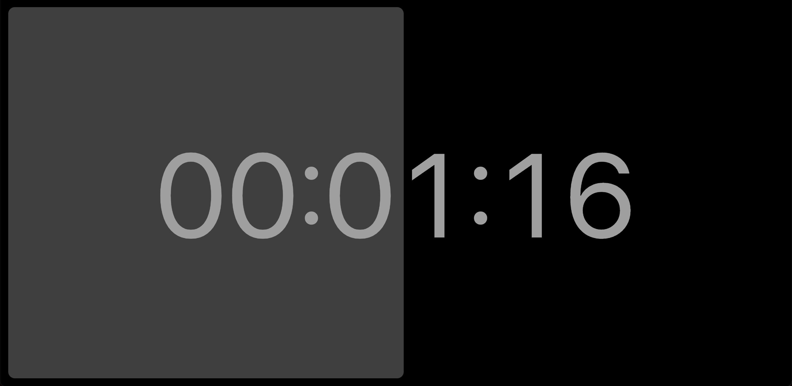

  

# [YinYang Clock](https://fabiospampinato.github.io/yinyang-clock)

A clock that keeps track of time spent yinning vs time spent yanging.

## Features

- It's basically just a bidirectional stopwatch, each time you click it the current side is paused and the other side is resumed.
- A Ctrl/Cmd+Click or a triple tap can be used to reset the clock.
- Appending [`?midnight`](https://fabiospampinato.github.io/yinyang-clock?midnight) to the url will switch to mightnight-mode, where the clock is anchored to the last midnight: it resets automatically at midnight and the yang side atomatically starts from there. Resetting the clock will be necessary to see a change.
- Appending [`?minimal`](https://fabiospampinato.github.io/yinyang-clock?minimal) to the url will switch to minimal-mode, where the clock is not rendered but only the background rectangles are.
- Appending [`?amoled`](https://fabiospampinato.github.io/yinyang-clock?amoled) to the url will switch to amoled-mode, where only a line is rendered and most of the app is pure black.

## License

MIT © Fabio Spampinato
